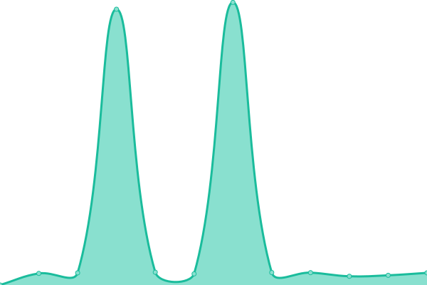

# [📈 실시간 상태](https://status.maratang.life): <!--live status--> **🟧 Partial outage**

This repository contains the open-source uptime monitor and status page for [마라탕.인생](https://maratang.life/), powered by [Upptime](https://github.com/upptime/upptime).

With [Upptime](https://upptime.js.org), you can get your own unlimited and free uptime monitor and status page, powered entirely by a GitHub repository. We use [Issues](https://github.com/MaratangLife/status/issues) as incident reports, [Actions](https://github.com/MaratangLife/status/actions) as uptime monitors, and [Pages](https://status.maratang.life) for the status page.

## [📈 Live Status](https://demo.upptime.js.org): <!--live status--> **🟧 Partial outage**

<!--start: status pages-->
<!-- This summary is generated by Upptime (https://github.com/upptime/upptime) -->
<!-- Do not edit this manually, your changes will be overwritten -->
<!-- prettier-ignore -->
| URL | Status | History | Response Time | Uptime |
| --- | ------ | ------- | ------------- | ------ |
|  [Splat00n.Ink Main](https://splat00n.ink/about) | 다운됨 | [splat00n-ink-main.yml](https://github.com/Lastorder-DC/splat00n_ink/commits/HEAD/history/splat00n-ink-main.yml) | 

 5512ms
     
 | 

<a href="https://status.splat00n.ink/history/splat00n-ink-main">95.56%</a>
    

|  [Splat00n.Ink API](https://splat00n.ink/api/v2/instance) | 다운됨 | [splat00n-ink-api.yml](https://github.com/Lastorder-DC/splat00n_ink/commits/HEAD/history/splat00n-ink-api.yml) | 

 3804ms
     
 | 

<a href="https://status.splat00n.ink/history/splat00n-ink-api">95.58%</a>
    

|  [Splat00n.Ink Streaming](https://splat00n.ink/api/v1/streaming/health) | 다운됨 | [splat00n-ink-streaming.yml](https://github.com/Lastorder-DC/splat00n_ink/commits/HEAD/history/splat00n-ink-streaming.yml) | 

 5016ms
     
 | 

<a href="https://status.splat00n.ink/history/splat00n-ink-streaming">95.61%</a>
    

|  [Splat00n.Ink User](https://splat00n.ink/api/v1/accounts/lookup?acct=admin) | 다운됨 | [splat00n-ink-user.yml](https://github.com/Lastorder-DC/splat00n_ink/commits/HEAD/history/splat00n-ink-user.yml) | 

 5022ms
     
 | 

<a href="https://status.splat00n.ink/history/splat00n-ink-user">95.63%</a>
    

|  [Splat00n.Ink ActivityPub](https://splat00n.ink/.well-known/webfinger?resource=acct:admin@splat00n.ink) | 다운됨 | [splat00n-ink-activity-pub.yml](https://github.com/Lastorder-DC/splat00n_ink/commits/HEAD/history/splat00n-ink-activity-pub.yml) | 

 4365ms
     
 | 

<a href="https://status.splat00n.ink/history/splat00n-ink-activity-pub">95.81%</a>
    

|  [Splat00n.Ink Storage](https://r2.maratang.life/check.txt) | 정상 | [splat00n-ink-storage.yml](https://github.com/Lastorder-DC/splat00n_ink/commits/HEAD/history/splat00n-ink-storage.yml) | 

 408ms
     
 | 

<a href="https://status.splat00n.ink/history/splat00n-ink-storage">100.00%</a>
    

<!--end: status pages-->

[**Visit our status website →**](https://status.maratang.life)

## 📄 License

- Powered by: [Upptime](https://github.com/upptime/upptime)
- Code: [MIT](./LICENSE) © [마라탕.인생](https://maratang.life/)
- Data in the `./history` directory: [Open Database License](https://opendatacommons.org/licenses/odbl/1-0/)
